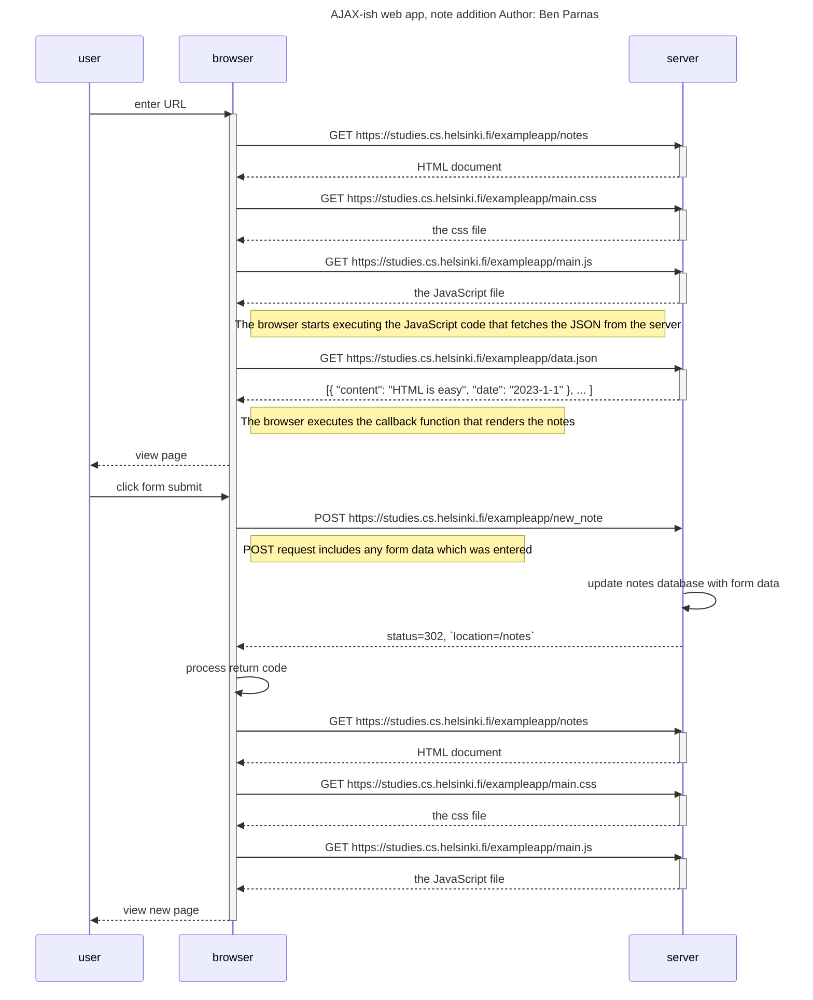

```mermaid
sequenceDiagram
    title AJAX-ish web app, note addition Author: Ben Parnas
    participant user
    participant browser
    participant server
    user->>browser: enter URL
    activate browser
    browser->>server: GET https://studies.cs.helsinki.fi/exampleapp/notes
    activate server
    server-->>browser: HTML document
    deactivate server

    browser->>server: GET https://studies.cs.helsinki.fi/exampleapp/main.css
    activate server
    server-->>browser: the css file
    deactivate server

    browser->>server: GET https://studies.cs.helsinki.fi/exampleapp/main.js
    activate server
    server-->>browser: the JavaScript file
    deactivate server

    Note right of browser: The browser starts executing the JavaScript code that fetches the JSON from the server

    browser->>server: GET https://studies.cs.helsinki.fi/exampleapp/data.json
    activate server
    server-->>browser: [{ "content": "HTML is easy", "date": "2023-1-1" }, ... ]
    deactivate server

    Note right of browser: The browser executes the callback function that renders the notes
    browser-->>user: view page
    user->>browser: click form submit
    browser->>server: POST https://studies.cs.helsinki.fi/exampleapp/new_note
    note right of browser: POST request includes any form data which was entered
    server->>server: update notes database with form data
    server-->>browser: status=302, `location=/notes`
    browser->>browser: process return code
    browser->>server: GET https://studies.cs.helsinki.fi/exampleapp/notes
    activate server
    server-->>browser: HTML document
    deactivate server

    browser->>server: GET https://studies.cs.helsinki.fi/exampleapp/main.css
    activate server
    server-->>browser: the css file
    deactivate server

    browser->>server: GET https://studies.cs.helsinki.fi/exampleapp/main.js
    activate server
    server-->>browser: the JavaScript file
    deactivate server
    browser-->>user:view new page
    deactivate browser

```