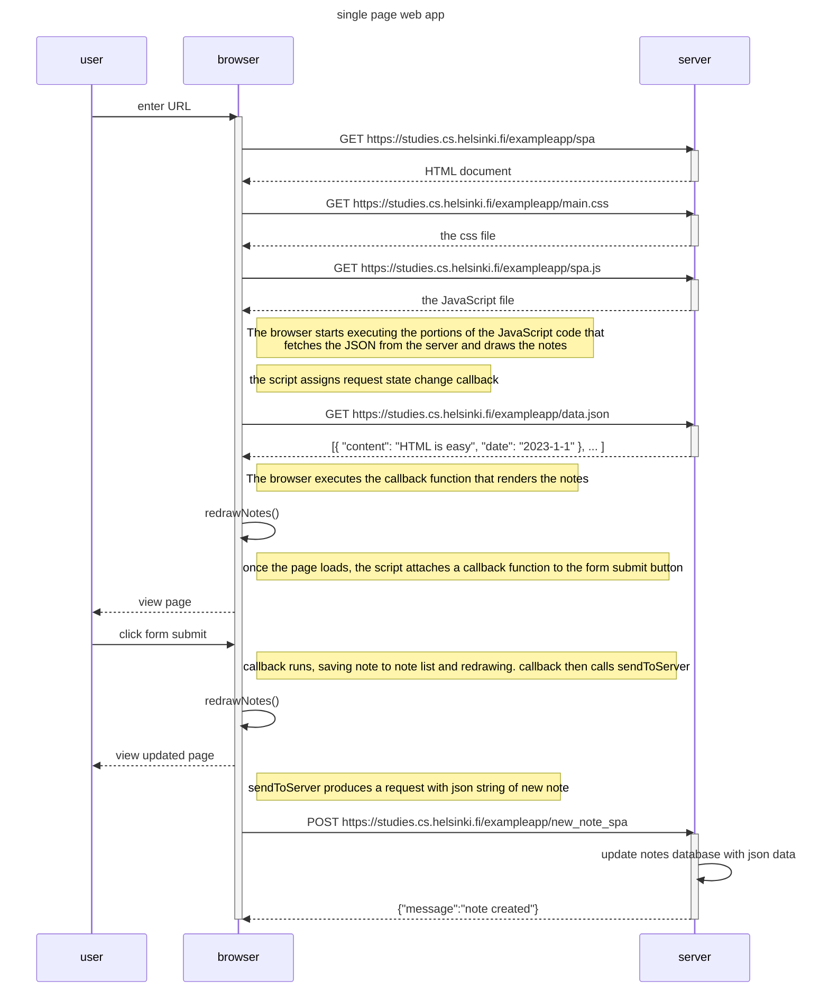

```mermaid
sequenceDiagram
    title single page web app 
    participant user
    participant browser
    participant server

    user->>browser: enter URL
    activate browser
    browser->>server: GET https://studies.cs.helsinki.fi/exampleapp/spa
    activate server
    server-->>browser: HTML document
    deactivate server

    browser->>server: GET https://studies.cs.helsinki.fi/exampleapp/main.css
    activate server
    server-->>browser: the css file
    deactivate server

    browser->>server: GET https://studies.cs.helsinki.fi/exampleapp/spa.js
    activate server
    server-->>browser: the JavaScript file
    deactivate server
    Note right of browser: The browser starts executing the portions of the JavaScript code that <br> fetches the JSON from the server and draws the notes
    Note right of browser: the script assigns request state change callback

    browser->>server: GET https://studies.cs.helsinki.fi/exampleapp/data.json
    activate server
    server-->>browser: [{ "content": "HTML is easy", "date": "2023-1-1" }, ... ]
    deactivate server
    Note right of browser: The browser executes the callback function that renders the notes
    browser->>browser:redrawNotes()
    Note right of browser: once the page loads, the script attaches a callback function to the form submit button
    browser-->>user:view page
    
    user->>browser: click form submit
    note right of browser: callback runs, saving note to note list and redrawing. callback then calls sendToServer
    browser->>browser:redrawNotes()
    browser-->> user: view updated page
    note right of browser: sendToServer produces a request with json string of new note
    browser->>server: POST https://studies.cs.helsinki.fi/exampleapp/new_note_spa
    activate server
    server->>server: update notes database with json data
    server-->>browser: {"message":"note created"}
    deactivate server
    deactivate browser

```